# air-quality-dashboard
Air quality monitoring dashboard for term project of Web Application Programming lecture.

# webpage
[https://minchocoin.github.io/air-quality-dashboard/](https://minchocoin.github.io/air-quality-dashboard/)

# How to run?
## download this code
```
git clone https://github.com/minchoCoin/air-quality-dashboard.git
```
## generate API key
you can generate api key on [https://www.weatherapi.com/](https://www.weatherapi.com/). after sign up and login, you can check the your api key on weatherapi mypage.

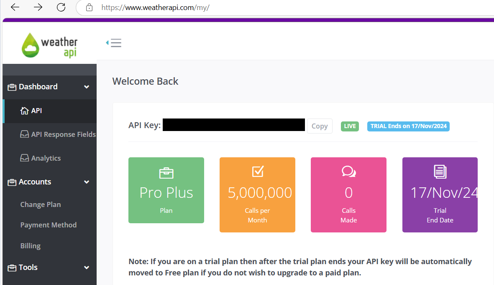

## generate key.js in js folder.
generate key.js in js folder. the content of the key.js is:
```js
const config = {
    apikey: 'enter your api key'
}
```
## double click index.html and check air quality
double click index.html and check air quality.

# demo video
[](https://youtu.be/VFPmD9clYjk?t=0s)

# features
## real-time air quality monitoring
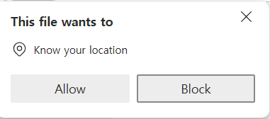

If you click on index.html, your browser will ask if you allow it to access your location. if you clicked 'Allow', you can view real-time air quality data like this:
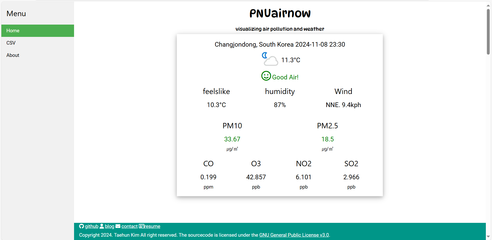
### you can check information
1. your location(city, country)
2. last-updated time
3. weather image
4. temperature
5. current total air quality level(good, moderate, unhealthy, dangerous)
6. feelslike temperature
7. humidity
8. wind(direction and speed)
9. various air quality data
    - pm10(μg/m^3)
    - pm2.5(μg/m^3)
    - CO(ppm)
    - O3(ppb)
    - NO2(ppb)
    - SO2(ppb)
### current total air quality level
current total air quality level is one of good(green), moderate(orange), unhealthy(red), and dangerous(purple). this level come from gb_defra_index: good air for 1-3 gb_defra_index, moderate air for 4-6 and bad for 7-9, very bad for 10.

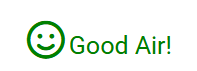


### text color of pm10 and pm2.5
[https://www.airgwangsan.kr/page/?site=airmap&mn=854](https://www.airgwangsan.kr/page/?site=airmap&mn=854)

text color of pm10 and pm2.5 represent the level of the fine dust level.
|       | good | moderate | bad    | very bad |
|-------|------|----------|--------|----------|
| pm10  | 0-30 | 31-80    | 81-150 | 151-     |
| pm2.5 | 0-15 | 16-50    | 51-100 | 101-     |

the text color of 'good' is blue, 'moderate' is green, 'bad' is orange, 'very bad' is red.
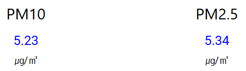
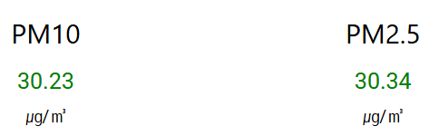
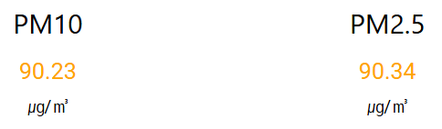
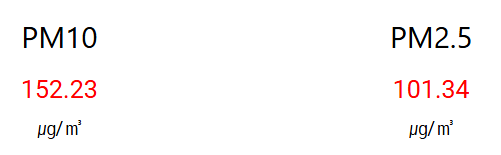

### chart
#### temperature chart
you can check temperature change from today to 3 days later forecast by the hour.
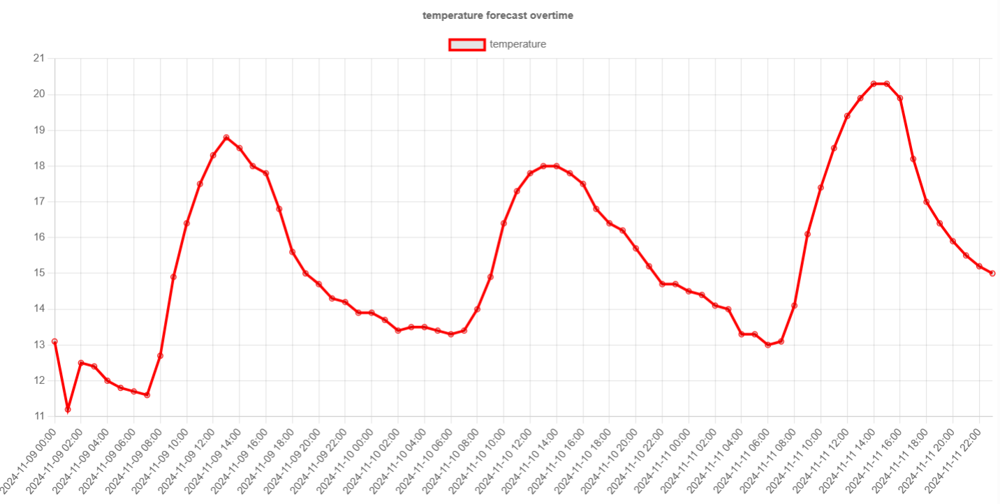

you can check values of the chart.

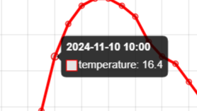

#### humidity chart
you can check humidity change from today to 3 days later forecast by the hour.
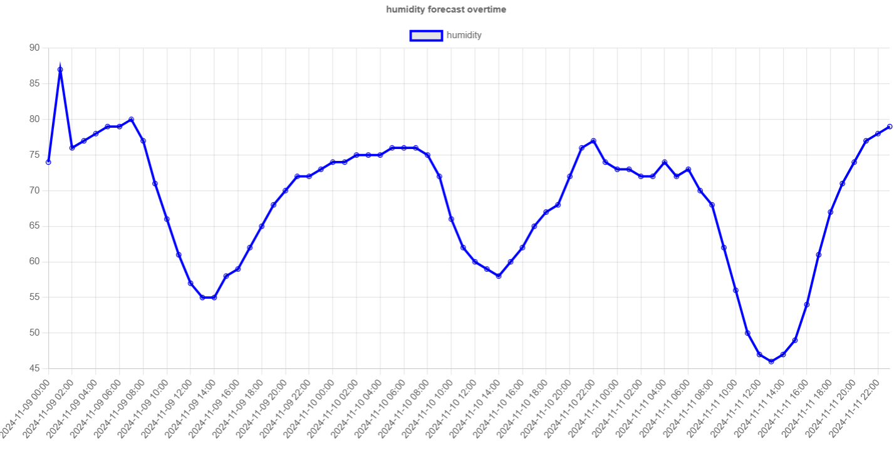
you can check values of the chart.

#### air pollutions bar chart
you can check the levels of PM10, PM2.5, CO, NO2, SO2 and O3.
the color of the bar chart is the color of total air quality level.
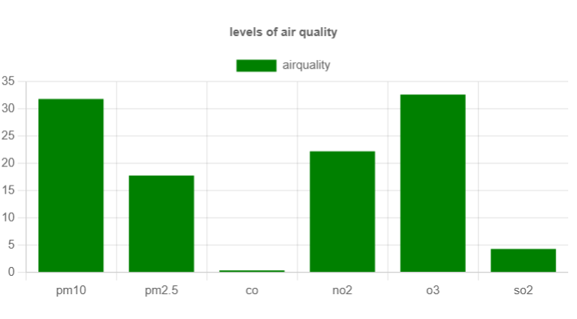

#### air pollutions doughnut chart
you can check the distribution of PM10, PM2.5, CO, NO2, SO2 and O3.
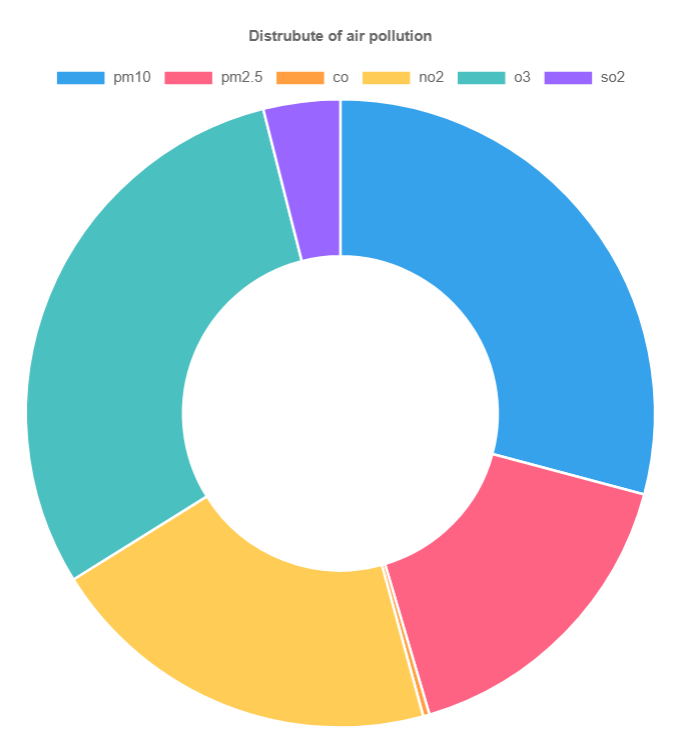

## CSV
if you clicked 'CSV' on the menu bar, you can page like this
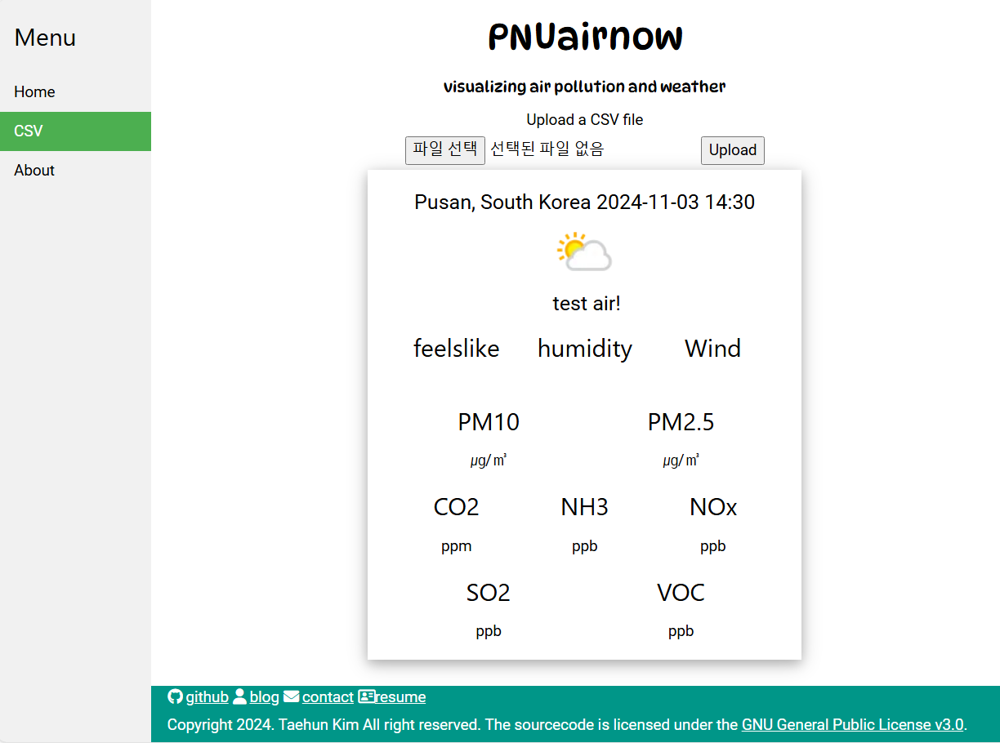
you can upload CSV file, and the page parsing the csv and shows the weather and air quality. parsing library is papaparse.

csv file format is:
```
time,cityname,country,current,temperature,humidity,feelslike,wind_dir,wind_kph,pm10,pm2_5,co2,Nox,NH3,SO2,VOC,gb_defra_index
2024-11-06 0:00,Pusan,South Korea,,9.8,62,,,,,,,,,,,
2024-11-06 1:00,,,,9.2,62,,,,,,,,,,,
2024-11-06 2:00,,,,8.7,55,,,,,,,,,,,
2024-11-06 3:00,,,,8,48,,,,,,,,,,,
2024-11-06 4:00,,,,7.7,46,,,,,,,,,,,
2024-11-06 5:00,,,,7.4,48,,,,,,,,,,,
2024-11-06 6:00,,,,7.4,50,,,,,,,,,,,
2024-11-06 7:00,,,,7,52,,,,,,,,,,,
2024-11-06 8:00,,,,8.3,34,,,,,,,,,,,
2024-11-06 9:00,,,,10.1,47,,,,,,,,,,,
2024-11-06 10:00,,,O,11.5,43,8.3,W,2.3,152.23,101.34,0.458,26.231,15.241,18.756,31.215,5
2024-11-06 11:00,,,,12.5,40,,,,,,,,,,,
2024-11-06 12:00,,,,13.1,37,,,,,,,,,,,
2024-11-06 13:00,,,,13.5,37,,,,,,,,,,,
...
```
time, temperature, humidity columns is required for all rows. cityname and country columns is required for first row. feelslike,wind_dir, wind_kph, pm10, pm2_5, co2, Nox, NH3, SO2, VOC, gb_defra_index is required for rows that the content of 'current' column is 'O'

Other features is same as 'real-time air quality monitor' page except air pollutions are PM10, PM2.5, CO2, NOx, NH3, SO2, VOC.

## about
you can check the information of air pollutions.
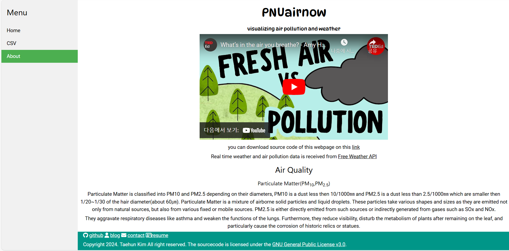

# css bootstrap
- [w3 css](https://www.w3schools.com/w3css/defaulT.asp)
- [font awesome 6.6.0](https://fontawesome.com/)

# js library
- [jquery 3.7.1](https://jquery.com/)
- [chart.js 4.4.1](https://www.chartjs.org/)
- [papaparse 5.4.1](https://www.papaparse.com/)

# fonts 
- [Dynapuff](https://fonts.google.com/specimen/DynaPuff): title and logo
- [Roboto](https://fonts.google.com/specimen/Roboto): other contents except title

# references
- [WeatherAPI docs](https://www.weatherapi.com/docs/)
- [css tutorial](https://www.w3schools.com/css/)
- [w3 css docs](https://www.w3schools.com/w3css/defaulT.asp)
- [font awesome docs](https://docs.fontawesome.com/)
- [jQuery API docs](https://api.jquery.com/)
- [Chart.js docs](https://www.chartjs.org/docs/latest/)
- [papaparse docs](https://www.papaparse.com/docs)
- [three.js examples](https://threejs.org/examples/)